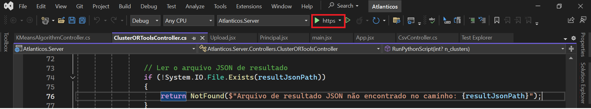

<table>
<tr>
<td>
<a href= "https://www.aegea.com.br/"></a>
</td>
<td><a href= "https://www.inteli.edu.br/"></a>
</td>
</tr>
</table>

# Introdução

&emsp;&emsp;Este é um dos repositórios do projeto de alunos do Inteli em parceria com a Aegea Saneamento S.A. no 1º semestre de 2024. Este projeto está sendo desenvolvido por alunos do Módulo 6 do curso de Ciência da Computação.


# Otimização de rotas de leitura de hidrômetros - Aegea Saneamento S.A.

# Grupo: *1*

## Integrantes:

- <a href="https://www.linkedin.com/in/andr%C3%A9-hutzler-60aa28277/">Andre Hutzler</a>
- <a href="https://www.linkedin.com/in/felipe-braga-69607126a/">Felipe Braga</a>
- <a href="https://www.linkedin.com/in/fernando-machado-santos/">Fernando Machado dos Santos</a>
- <a href="https://www.linkedin.com/in/gabrielcolettosilva/">Gabriel Colleto Silva</a>
- <a href="https://www.linkedin.com/in/gabriel-demacedosantos/">Gabriel de Macedo Santos</a>
- <a href="https://www.linkedin.com/in/giovana-katsuki-murata-503a94264/">Giovana Katsuki Murata</a>
- <a href="https://www.linkedin.com/in/leonardokalid/">Leonardo Kalid Guene</a>

## Professores:

### Orientador:

- <a href="https://www.linkedin.com/in/tmsasaki/?originalSubdomain=br">Tomaz Mikio Sasaki</a>

### Instrutores:

- <a href="https://www.linkedin.com/in/pedroteberga/">Pedro Teberga</a>
- <a href="https://www.linkedin.com/in/cristinagramani/">Cristina Gramani</a>
- <a href="https://www.linkedin.com/in/rafael-will-m-de-araujo-20809b18b//">Rafael Araujo</a>
- <a href="https://www.linkedin.com/in/sergio-venancio-a509b342//">Sergio Venancio</a>

# Descrição

&emsp;&emsp;Este projeto visa desenvolver um algoritmo avançado para otimizar as rotas de leitura de hidrômetros da Aegea, utilizando modelagem matemática e técnicas de otimização. O objetivo principal é maximizar a eficiência das rotas de leitura, garantindo que o maior número possível de leituras seja realizado no menor tempo e com a menor distância percorrida. Por meio da implementação de um modelo de otimização baseado em restrições operacionais, como o número máximo de dias de leitura e a duração diária das rotas, busca-se melhorar a entrega de contas e a adimplência dos clientes. Espera-se que esse sistema inovador possa ser testado e implementado em um prazo definido, proporcionando uma redução significativa no custo operacional e um aumento na satisfação do cliente.

# Configuração de desenvolvimento

*Procedimento para baixar e executar o código deste projeto.*

## Instalação de dependências 
&emsp;&emsp;Execute esse no terminal para baixar localmente as dependências necessárias:

``` pip install -r ./requirements.txt```

&emsp;&emsp;Baixe o Visul Studio para a execução do back-end, disponível em: https://visualstudio.microsoft.com/pt-br/downloads/

### Clonar o Repositório: 
&emsp;&emsp;Clone este repositório em sua máquina local usando o seguinte comando:
   ```bash
   git clone https://github.com/seu-usuario/repositorio-do-projeto.git
   ```

### Instalação de Dependências do Frontend (Node.js):
   - Navegue até o diretório do frontend:
     ```bash
     .\codigo\Atlanticos\atlanticos.client
     ```
   - Instale as dependências usando npm:
     ```bash
     npm install
     ```

## Executar o front-end 
&emsp;&emsp;Para executar o front é necessário no ir no terminal do diretório ".\codigo\Atlanticos\atlanticos.client", e executar:

     npm start

&emsp;&emsp;Isso executará o Frontend da Aplicação

&emsp;&emsp;Após iniciar o servidor, você pode verificar se está funcionando acessando:

```http://localhost:3000```

&emsp;&emsp;Substitua '3000' pela porta configurada no seu projeto, se diferente.

## Executar o back-end 
&emsp;&emsp;Para executar o back-end é necessario abrir o projeto no Visual Studio anteriormente baixado.

&emsp;&emsp;Após isso, é necessário no ir no terminal do diretório ".\codigo\Atlanticos\atlanticos.Server", e executar:

    dotnet run

&emsp;&emsp;Uma alternativa a isso é só localizar o botão play que estará escrito "https"¹ e o back-end será executado, direcionando o usuário para o navegador onde será aberto o Swagger com todos os algoritmos.

<div align="center">
<sub>Figura 1 - Botão de execução do Back-end.</sub>

<sup>Fonte: Material produzido pelos autores (2024)</sup>
</div>


# Releases

* SPRINT 1 - 16/04/2024:
    - *Entendimento da Experiência do Usuário*;
    - *Entendimento do Contexto do Problema*; 
    - *Entendimento do Negócio*;

* SPRINT 2 - 29/04/2024:
    - *Desenvolvimento de algoritmos de caminho minímo*;
    - *Desenvolvimento de um MockUp e um Wireframe para a solução*;
    - *Início do desenvolvimento do artigo*;
    - *Refinamento da modelagem matemática*.

* SPRINT 3 - 13/05/2024:
    - *Revisão do artigo*;
    - *Desenvolvimento do backend da solução*;
    - *Desenvolvimento do front-end da solução*;
    - *Implementação de novos algoritmos*;
    - *Limpeza dos dados para melhor performance dos algoritmos*

* SPRINT 4 - 27/05/2024:
    - *Adição Resultados obtidos no artigo*;
    - *Refinamento do back-end da solução*;
    - *Refinamento do front-end da solução*;
    - *Construção do algoritmo Ant Colony*;
    - *Complexidade e corretude dos algoritmos desenvolvidos*;
    - *Integração do back-end com o front-end da solução*.

* SPRINT 5 - 10/06/2024:
    - *Finalização do artigo*;
    - *Integração do back-end com o front-end e refinamento da solução*;
    - *Testes de usabilidade*;
    - *Apresentação final para o parceiro*.

## 📋 Licença/License

<p xmlns:cc="http://creativecommons.org/ns#" xmlns:dct="http://purl.org/dc/terms/">

<a property="dct:title" rel="cc:attributionURL">Grupo 1</a> by <a rel="cc:attributionURL dct:creator" property="cc:attributionName">Inteli, <a href="https://www.linkedin.com/in/andr%C3%A9-hutzler-60aa28277/">Andre Hutzler</a>, <a href="https://www.linkedin.com/in/felipe-braga-69607126a/">Felipe Braga</a>, <a href="https://www.linkedin.com/in/fernando-machado-santos/">Fernando Machado dos Santos</a>, <a href="https://www.linkedin.com/in/gabrielcolettosilva/">Gabriel Colleto Silva</a>, <a href="https://www.linkedin.com/in/gabriel-demacedosantos/">Gabriel de Macedo Santos</a>, <a href="https://www.linkedin.com/in/giovana-katsuki-murata-503a94264/">Giovana Katsuki Murata</a>, <a href="https://www.linkedin.com/in/leonardokalid/">Leonardo Kalid Guene</a> is licensed under <a href="https://creativecommons.org/licenses/by/4.0/" rel="license noopener noreferrer" style="display:inline-block;">Attribution 4.0 International</a>.</p>
