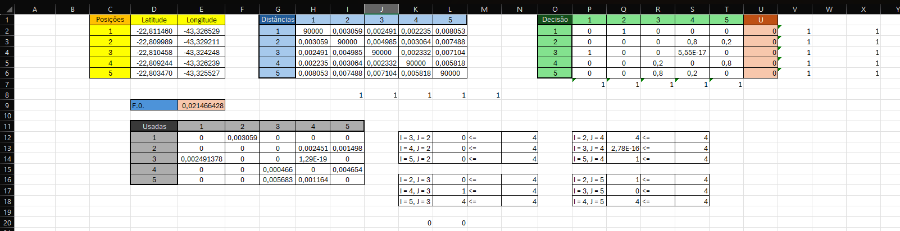

# Entendimento do contexto do problema: Modelagem e Representação

&emsp;&emsp;Este artefato pretende compreender as nuances matemáticas que existem ao redor do problema apresentado e da sua correspondente solução, descrevendo, assim, a estruturação da questão e a formulação teórica do algoritmo.

## Qual o contexto do problema a ser resolvido?

&emsp;&emsp;Mensalmente, a Aegea Saneamento envia um leiturista para realizar a leitura dos hidrômetros nas instalações de seus múltiplos clientes, um processo essencial para determinar o custo mensal da água consumida. Cada leiturista recebe, através de um aplicativo, as rotas que deve seguir diariamente, incluindo ruas e casas designadas para visita. A empresa tem como objetivo completar todas as leituras em até 22 dias úteis, um desafio logístico significativo.  
&emsp;&emsp;Na concessionária Águas do Rio, no estado do Rio de Janeiro, cerca de 400 leituristas cobrem aproximadamente 4000 rotas. Nesse contexto, a otimização dessas rotas é crucial, não apenas para melhorar a eficiência operacional, reduzindo custos e esforços, mas também para impactar o número de leituristas necessários, liberando-os para outras atividades.  
&emsp;&emsp;Além disso, uma modelagem eficaz deve minimizar travessias desnecessárias de ruas e se adaptar aos obstáculos naturais e à topologia da área, aumentando a segurança dos leituristas e reduzindo o esforço necessário para completar a rota dentro das 6 horas diárias almejadas pela Aegea.  
&emsp;&emsp;Assim, o algoritmo desenvolvido deve otimizar as rotas de leitura na região de Águas do Rio, oferecendo os melhores caminhos para visitar todos os hidrômetros, reduzindo o custo e o esforço operacional em vários setores da empresa. Para isso, deve-se considerar a quantidade de funcionários, os diferentes quarteirões, a posição geográfica e a distância entre os clientes, entre outros fatores.

 ## Quais os dados disponíveis?
&emsp;&emsp;Os dados disponíveis foram fornecidos pelos clientes em formato CSV, contendo as seguintes informações:

- Índice: Identificador único composto por 9 algarismos para cada hidrômetro.
- Latitude: Distância angular de um ponto em relação ao Equador, medida ao longo de um arco de meridiano. A latitude é medida em graus, variando de 0° no Equador até 90° nos polos Norte e Sul.
- Longitude: Distância angular de um ponto em relação ao Meridiano de Greenwich, medida ao longo do equador. A longitude é medida em graus, variando de 0° a 180° a leste e oeste do Meridiano de Greenwich.
- Código da rota: Código que representa o agrupamento de hidrômetros lidos por um leiturista em um dia específico.
- Sequência: Número que indica a ordem do hidrômetro em uma determinada rota, por exemplo, o número 10 indica o 10º hidrômetro a ser lido naquele dia.
- Logradouro: Descreve o nome de ruas, avenidas, praças, travessas, ou qualquer outra via pública que compõe a estrutura urbana de uma cidade ou localidade, entendido como o endereço do hidrômetro.
- Número: Número referente ao logradouro.

&emsp;&emsp;Através dos dois conjuntos de dados disponibilizados - 'Amostra_Menor' (com 6.080 registros) e 'Amostra_Total' (com 378.300 registros) - assim como a localização das bases da Aegea, será possível produzir dados de suma importância para a modelagem, como a distância entre os pontos e os fatores topológicos de cada localização.

 ## Qual o objetivo do problema?

&emsp;&emsp;O objetivo principal do problema é otimizar as rotas de leitura de hidrômetros para os leituristas da concessionária Águas do Rio. A intenção é desenvolver um algoritmo que minimize o tempo total de deslocamento e leitura. Este algoritmo buscará encontrar os caminhos ótimos para que todos os hidrômetros sejam visitados com o mínimo de esforço operacional e custo, considerando fatores como a quantidade de funcionários, a distribuição geográfica dos quarteirões, e a distância entre as localidades dos clientes.

 ## Limitações da problemática

 &emsp;&emsp;Neste problema em questão e baseando-se nos esclarecimentos realizados durante a apresentação do projeto, encontram-se como limitantes essenciais do problema:
 - A quantidade total de dias nos quais essa leitura deve ser realizada (22 dias).
 - A quantidade total de horas diárias de trabalho permitidas pela legislação (levando em consideração o tempo de locomoção até o começo do trajeto e o de distribuição dos caminhos, o período total disponível para as leituras é de 6 horas diárias).

 ## Quais são as expressões matemáticas que representam a função objetivo e as restrições/limitações do problema?

**Variáveis de Decisão e Domínios:**

$$
x_{ij} \hspace{0.2cm} \epsilon \hspace{0.2cm} \{0, 1\} , \forall i, j = 1, 2, ...,  n, \hspace{0.15cm} i \neq j \\
u_i \hspace{0.2cm} \epsilon \hspace{0.2cm} \mathbb{R^+}, \forall i = 1, 2, ..., n.
$$

**Função Objetivo:**  
&emsp;&emsp;A função objetivo procura minimizar a soma dos produtos entre o peso e as variáveis de decisão. O peso, geralmente definido como a distância em quilômetros, representa a medida de custo associada à utilização de cada rota. A função objetivo é expressa como:

$$ min  \sum_{i=1}^{n} \sum_{i=1, j\neq i}^{n} c_{ij} x_{ij}, \hspace{2.3cm}$$

Onde:
- $x_{ij}$ é uma variável de decisão que indica se a rota entre os hidrômetros $i$ e $j$.
- $c_{ij}$ é o custo associado à utilização da rota entre os hidrômetros $i$ e $j$.  

&emsp;&emsp;As restrições do problema são definidas da seguinte forma:

1. **Restrições de Conectividade**

As restrições de conectividade garantem que cada hidrômetro esteja conectado exatamente a um outro hidrômetro:

$$
\qquad \sum_{j=1, j\neq i}^{n} x_{ij} = 1, \quad \text{para cada } i = 1, 2, ..., n, \\
\qquad \sum_{i=1, i\neq j}^{n} x_{ij} = 1, \quad \text{para cada } j = 1, 2, ..., n, \\
$$

Onde $x_{ij}$ é uma variável binária que indica se existe um caminho direto do hidrômetro $i$ para o hidrômetro $j$.

2. **Restrições de Eliminação de Ciclo**

Para evitar ciclos entre os hidrômetros, utilizamos:

$$
\hspace{3cm} u_i - u_j + nx_{ij} \le n - 1,\quad 2 \le i \neq j \le n,
$$

Onde $u_i$ é uma variável de relaxação usada para ordenar os hidrômetros no percurso e eliminar ciclos no grafo de hidrômetros.

3. **Restrição para Garantir o Fluxo Correto de Leituristas**

Esta restrição assegura que se um veículo chega a um hidrômetro, ele deve sair dele, garantindo o fluxo adequado:

$$
\qquad \sum_{i=0, i\neq h}^{n} x_{ih} - \sum_{j=1, j\neq h}^{n+1} x_{hj} = 0, \quad \text{para cada } h = 1, 2, ..., n.
$$

4. **Restrição da Quantidade de Rotas, Dada a Quantidade de Leituristas**

A quantidade de rotas iniciadas é limitada pelo número de leituristas disponíveis:

$$
\qquad \sum_{j=1}^{n} x_{0j} = K,
$$

Onde $K$ é o número total de leituristas.

 ## Análise de sensibilidade do problema

&emsp;&emsp; A análise de sensibilidade de um problema matemático consiste, em termos gerais, em uma avaliação que pretende estimar o impacto da alteração de diferentes variáveis em um procedimento estipulado. Com este processo, após a sinalização da concretude e viabilidade de uma solução ótima, pode-se inferir como os diferentes parâmetros são capazes de impactar as análises descritas algoritmicamente.  
&emsp;&emsp; A priori, uma das instâncias que influencia diretamente a resolução é o **número de leituristas disponíveis**. Dependendo da disposição de colaboradores, considera-se possível a criação (ou destituição) de rotas adicionais, variando proporcionalmente ao número de contratados para este serviço, e, consequentemente, implica diretamente na variação no tempo total de trabalho.  
&emsp;&emsp;De maneira semelhante, o **tempo total que um leiturista utiliza para realizar uma leitura** ou, igualmente, o **período de trajeto em relação à velocidade relativa**, são uma consideração extra na contabilidade de horas totais gastas por rota. Na descrição atual, estes valores são fixos em 2 minutos e 5 quilômetros por hora, respectivamente. Se, por acaso, ocorrer uma mudança no valor destes, ela implicará diretamente no tempo total utilizado no trabalho.  
&emsp;&emsp;Outro exemplo que demonstra essa influência dos parâmetros é o **custo (distância)** entre determinados hidrômetros. Se esta, em determinada situação, se alterar em algum dos deslocamentos, impactará na somatória total da distância da rota e, de maneira contígua, no caminho total de percurso. Em uma situação hipotética na qual dois hidrômetros são afastados de maneira significativa, o modelo matemático vai alterar seu direcionamento de rotas em questão da mudança, buscando os menores caminhos e, provavelmente, fazendo diferentes agrupamentos.  
&emsp;&emsp;A análise acima, entretanto, é superficial e não reage diretamente às restrições e função objetivo supracitadas. Pensando em compreender inteiramente a influência da alteração de parâmetros dentro do algoritmo, foi realizada um relatório de sensibilidade no *Excel*, no qual foram incluídos 5 pontos distintos com suas latitudes e longitudes. Incluídas as restrições e buscando minimizar o custo (neste caso, a distância em quilômetros de uma rota), foi utilizado o solver para a geração da tabela abaixo:  

Figura 1 - Retalório de sensibilidade 
 
Fonte: Material produzido pelos autores (2024)

&emsp;&emsp;Inicialmente, é importante citar o que é cada uma das colunas demonstradas na imagem acima. Constam

| Nome da coluna             | Descrição                                                                                         | |
|--------------------|---------------------------------------------------------------------------------------------------|-----------------------------------------------------------------------------------------------------------|
| **Célula**       | Localização da variável na tabela do *Excel*                                                    | 
| **Nome**       | Neste caso, não consta. Seria o nome dado para o parâmetro                                    |
| **Final Valor**       | Quantidade utilizada na solução final                                          |
| **Custo Reduzido**       | Demonstra quanto a presença ou ausêntica de um parâmetro influencia no custo final                                        |
| **Coeficiente Objetivo**       | Multiplicador das variáveis na função objetivo           |
| **Permitido Reduzir**       | Quanto se pode reduzir sem alterar a solução ótima                                                            | 
| **Permitido Aumentar**       | Quanto se pode aumentar sem alterar a solução ótima                                                                   |                           |

&emsp;&emsp;Ademais, é essencial destacar que a tabela utilizada e suas restrições estão demonstradas abaixo:

Figura 1 - Retalório de sensibilidade 
 
Fonte: Material produzido pelos autores (2024)

&emsp;&emsp;Pensando nisso, podemos verificar algumas características interessantes da configuração matemática descrita nas etapas anteriores:

- Os pontos P2, R3, S4, T5, U6 equivalem aos pontos que representam a interligação (na matriz) do mesmo ponto. A fim de evitar ligações (pensando que se busca a menor distância total) entre pontos de mesmo índice, o custo local (inicialemtne zero) foi substituído por um valor deliberadamente alto. No relatório de sensibilidade, pode-se verificar este impacto através do custo reduzido em retirar cada um dos pontos acima da solução. 

- A não utilização do ponto S2 (que sai de 1 e chega em 4) resultou em um descréscimo do custo de 0,000846184. Isso demonsta que, possivelmente, a solução ótima não deve considerar esse ponto.

- Em contrapartida, o ponto 4 é ponto de chegada de outras 3 localidades, sendo estas o ponto 2, 3 e 4, na solução ótima (lembre-se que, na geração da análise de sensibilidade, considera-se o problema como linear, e não inteiro. Esta possibilidade implica em um melhor entendimento) De maneira consecutiva, a saída do ponto 2 para o ponto 4 é, assim como visto na planilha, a melhor opção (mas não a única) na geração de uma solução que passe por esta localidade.

- O impacto da utilização de pontos não presentes no melhor caminho é gigantesca, incrementando em muito o valor da distância total, considerando o resultado final de 0,021466428 para estes dados. 

- A distância entre os pontos segue sendo a principal consideração quando se trata de construir as melhores ligações, já que o objetivo é organizar os pontos na proposta de minimizar a função objetivo. A influência da não utilização destes no relatório de sensibilidade descrevem bem que são o principal parâmetro na análise matemática descrita por este grupo.

- Os $ u's $ (variáveis de relaxamento presentes na segunda restrição do tópico anterior) apresentam um baixíssimo impacto na solução, assim como era esperado, vide que são apenas variáveis de relaxamento para impedir a formação de ciclos. 

