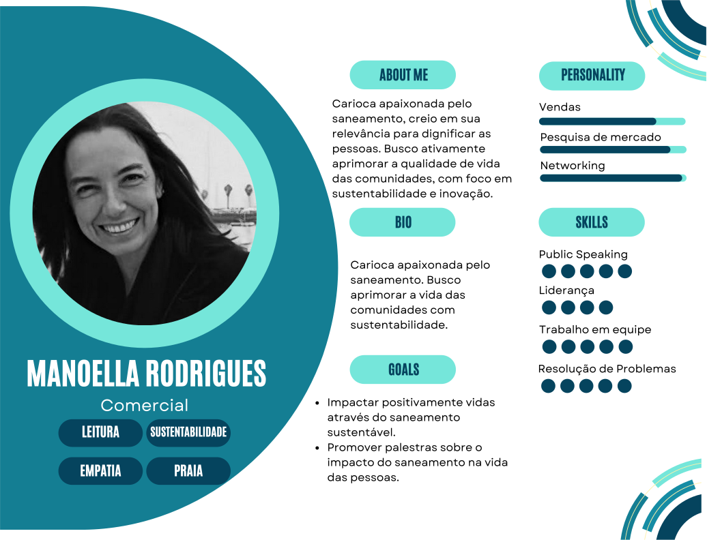
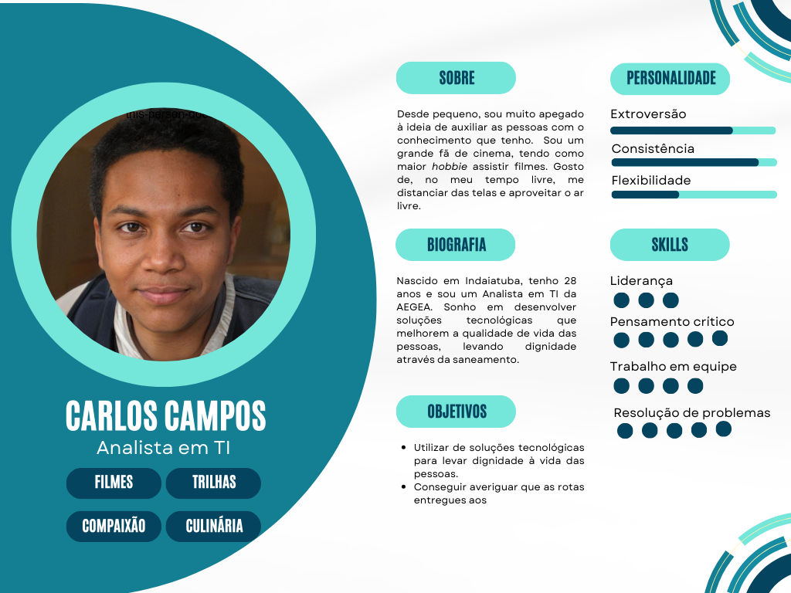
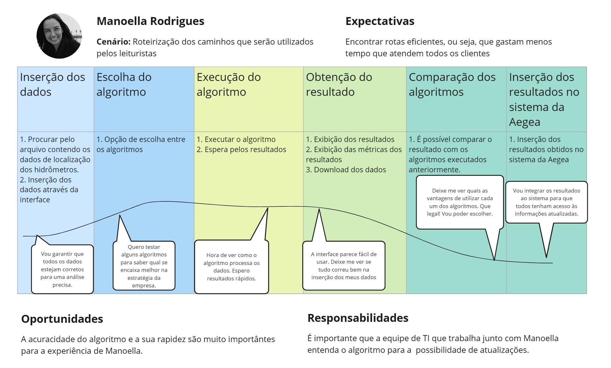

# Entendimento da experiência do usuário

## Personas

&emsp;&emsp;Segundo Siqueira (2022), uma Persona é uma representação fictícia que encapsula o cliente ideal para um projeto específico. A criação dessas personas é fundamentada em dados concretos sobre o comportamento e as características demográficas dos clientes, fornecendo à equipe uma compreensão mais completa das necessidades, preocupações e objetivos de diferentes tipos de usuários. Cada Persona é dotada de uma narrativa única, composta por motivações, objetivos, desafios e preocupações que se integram de forma relevante ao contexto do projeto. Tal abordagem possibilita uma análise mais profunda do público-alvo e suas demandas, direcionando de maneira eficaz o desenvolvimento do projeto.

Figura 1 - Persona Manoella Rodrigues

Fonte: Material produzido pelos autores (2024)

&emsp;&emsp;Manoella Rodrigues é uma carioca apaixonada pelo saneamento, acreditando firmemente em sua relevância para dignificar as pessoas. Ela busca ativamente aprimorar a qualidade de vida das comunidades, concentrando-se em sustentabilidade e inovação.

### Backgroung profissional:

&emsp;&emsp;Manoella Rodrigues é uma profissional dedicada e experiente na área comercial, atualmente desempenhando o papel crucial de planejadora na Aegea Saneamentos.

### Dores

&emsp;&emsp;Manoella Rodrigues enfrenta o desafio de promover melhorias significativas na qualidade de vida das comunidades através do saneamento sustentável. No entanto, ela se depara com a realidade operacional de processos de leitura de hidrômetros que podem ser ineficientes, demorados e pouco sustentáveis. Isso gera uma série de dores, incluindo:

1. **Ineficiência Operacional:** A necessidade de enviar leituristas mensalmente para realizar a leitura dos hidrômetros pode ser um processo trabalhoso e pouco eficiente. Isso pode resultar em tempo desperdiçado, custos adicionais e uma operação que não está otimizada para lidar com grandes volumes de leituras.

2. **Desafios de Produtividade:** O tempo gasto na leitura dos hidrômetros e na conclusão das rotas pode afetar a produtividade dos leituristas, além de impactar diretamente na efetividade da leitura e na entrega de contas aos clientes. Manoella busca maneiras de otimizar esses processos para aumentar a eficiência e reduzir os tempos de conclusão das tarefas.

### Desafio Profissional:

&emsp;&emsp;Manoella Rodrigues enfrenta o desafio de promover a conscientização sobre a importância do saneamento sustentável e inovador para melhorar a qualidade de vida das comunidades.

### Metas e Objetivos:

- Impactar positivamente vidas através do saneamento sustentável, buscando proporcionar condições dignas para as pessoas.
- Promover palestras sobre o impacto direto do saneamento na vida das pessoas, visando disseminar conhecimento e incentivar a adoção de práticas mais sustentáveis.

### Motivação:

&emsp;&emsp;Manoella é motivada pela crença inabalável de que o saneamento é essencial para dignificar as pessoas e garantir seu bem-estar. Sua paixão pela causa a impulsiona a buscar constantemente formas de melhorar a qualidade de vida das comunidades em que atua.

### Caracteristicas Pessoais:

&emsp;&emsp;Manoella Rodrigues é dedicada, comprometida e apaixonada pelo que faz. Sua determinação e entusiasmo são contagiantes, inspirando aqueles ao seu redor a se engajarem na busca por soluções sustentáveis para os desafios do saneamento.

### Sonho:

&emsp;&emsp;O grande sonho de Manoella é ver um mundo onde todas as pessoas tenham acesso a condições de vida dignas e saudáveis, onde o saneamento não seja mais um problema, mas sim uma realidade sustentável e acessível para todos.

Figura 2 - Persona Carlos Campos

Fonte: Material produzido pelos autores (2024)

&emsp;&emsp;Carlos Campos é um analista de TI com uma paixão por auxiliar as pessoas através do conhecimento que possui. Apaixonado por cinema, ele encontra no tempo livre uma oportunidade de se distanciar das telas e aproveitar o ar livre.

### Background Profissional:
&emsp;&emsp;Nascido em Indaiatuba, aos 28 anos, Carlos é um Analista em TI na AEGEA. Seu sonho é desenvolver soluções tecnológicas que melhorem a qualidade de vida das pessoas, levando dignidade através do saneamento.

### Dores:
1. **Ineficiência Operacional:** Carlos enfrenta a necessidade de lidar com processos de TI que podem ser ineficientes e pouco otimizados. Isso pode resultar em desperdício de tempo, recursos e uma operação que não está totalmente alinhada com as demandas atuais.
2. **Desafios de Produtividade:** O tempo gasto em tarefas rotineiras e a falta de automação em processos podem afetar a produtividade de Carlos e da equipe de TI. Ele busca maneiras de otimizar esses processos para aumentar a eficiência e liberar tempo para atividades mais estratégicas e inovadoras.

### Desafio Profissional:
&emsp;&emsp;Carlos enfrenta o desafio de promover a integração de soluções tecnológicas inovadoras que melhorem a eficiência operacional e impulsionem o crescimento da empresa.

### Metas e Objetivos:
- Desenvolver e implementar soluções tecnológicas que melhorem a qualidade de vida das pessoas, especialmente na área de saneamento.
- Promover a adoção de práticas mais eficientes e sustentáveis dentro da empresa, visando o crescimento e a inovação contínua.

### Motivação:
&emsp;&emsp;Carlos é motivado pela oportunidade de utilizar sua expertise em TI para fazer a diferença na vida das pessoas, contribuindo para um mundo mais tecnologicamente avançado e sustentável.

### Características Pessoais:
&emsp;&emsp;Carlos Campos é determinado, analítico e apaixonado por resolver problemas complexos. Sua habilidade em pensar de forma crítica e sua liderança eficaz o tornam um membro valioso da equipe de TI.

### Sonho:
&emsp;&emsp;O grande sonho de Carlos é ver suas soluções tecnológicas impactando positivamente a vida das pessoas, promovendo um ambiente mais eficiente, sustentável e conectado.
 
&emsp;&emsp;Ele também almeja garantir que as rotas entregues aos funcionários sejam as melhores possíveis, alavancando o desempenho da empresa.

## User Stories

&emsp;&emsp;Uma "user story" (história de usuário) é uma ferramenta utilizada em metodologias ágeis para descrever, de forma concisa e centrada no usuário, as funcionalidades que um sistema ou produto deve ter. Geralmente, as user stories seguem um formato simples: "Como [quem], eu quero [o que], para [por que]". Este formato permite que os requisitos sejam expressos a partir da perspectiva do usuário final, dando foco ao valor entregue e à motivação por trás do recurso solicitado.

&emsp;&emsp;No contexto do projeto proposto, a otimização das rotas de leitura para leituristas, as user stories fornecem uma maneira eficaz de capturar as necessidades dos usuários e as funcionalidades que o sistema deve fornecer.Ao compreender as dores e desafios enfrentados pela nossa persona, podemos estruturar user stories que refletem seus objetivos e desejos para melhorar a eficiência operacional.

### User story 1
&emsp;&emsp;Como Carlos,analista de TI, eu quero automatizar o processo de sequenciamento das rotas, para reduzir erros humanos e garantir consistência nos roteiros.

 - **Critérios de Avaliação**: 
    -  O sistema deve gerar sequências de rotas automaticamente com base em critérios de otimização, como tempo e distância.
    - As rotas automatizadas devem manter uma consistência mínima, sem mudanças abruptas ou incoerentes entre execuções.

### User story 2
&emsp;&emsp;Como Carlos, analista de TI, eu quero otimizar as rotas para os leituristas, para melhorar a eficiência do processo de leitura e reduzir a distância percorrida, além de reduzir o tempo gasto em tarefas rotineiras e focar em atividades mais estratégicas.

- **Critérios de Avaliação**: 
  - O algoritmo deve reduzir a distância total percorrida pelos leituristas comparação com o método atual.
  - O algoritmo deve permitir a conclusão das rotas no prazo definido (22 dias) e dentro do limite de horas diárias (6 horas).

### User story 3
&emsp;&emsp;Como Carlos, analista de TI, eu quero implementar um sistema de monitoramento para identificar ineficiências operacionais, para que a equipe possa agir proativamente para corrigir problemas.

- **Critérios de Avaliação**:
    - O algoritmo deve reduzir a distância total percorrida pelos leituristas comparação com o método atual.
    - O algoritmo deve permitir a conclusão das rotas no prazo definido (22 dias) e dentro do limite de horas diárias (6 horas).

### User story 4
Como Manoella, planejadora na Aegea Saneamentos, eu quero automatizar os processos de leitura de hidrômetros para otimizar a eficiência operacional e reduzir custos.

 - **Critérios de Avaliação**: 
    - O custo operacional é reduzido após a implementação da automação.
    -  O novo processo de leitura de hidrômetros requer menos leituristas do que antes.

### User story 5
 Como Manoella, planejadora na Aegea Saneamentos, eu quero otimizar a produtividade dos leituristas para aumentar a eficiência das leituras e melhorar a entrega das contas.

- **Critérios de Avaliação**: 
    - As rotas otimizadas aumentam a produtividade dos leituristas.
    - O tempo médio entre leituras é reduzido para menos de 2 minutos

### User story 6
Como Manoella, planejadora na Aegea Saneamentos, eu quero reduzir a ineficiência operacional nas leituras de hidrômetros para otimizar o tempo de conclusão das rotas.

- **Critérios de Avaliação**: 
    - A implementação de um novo sistema reduz o tempo de conclusão das rotas
    - As rotas otimizadas diminuem a distância total percorrida pelos leituristas

## Jornada do Usuário

&emsp;&emsp;A Jornada do Usuário é um framework de experiência do usuário que visa analisar o percurso da usabilidade de uma representação do público-alvo, geralmente uma persona desenvolvida, dentro de um sistema ou situação específica. Esse processo mapeia o cenário, expectativas, responsabilidades e oportunidades que correspondem à persona em questão. A partir disso, são delineadas as etapas de interação, onde o usuário ideal realiza sua tomada de decisão em cada ponto do caminho, enquanto expressa seus sentimentos em relação a essa interação.

&emsp;&emsp;Ao empregar a Jornada do Usuário, é possível compreender de forma mais profunda e holística a experiência do usuário, identificando pontos de fricção, momentos de satisfação e oportunidades de melhoria ao longo do percurso. Este framework se torna uma ferramenta valiosa para o design de produtos e serviços centrados no usuário, permitindo uma abordagem mais empática e eficaz no atendimento às necessidades e expectativas do público-alvo.

&emsp;&emsp;A seguir, pode-se ver a jornada descrita pelos autores deste documento:

Figura 3 - Jornada do Usuário

Fonte: Material produzido pelos autores (2024)

&emsp;&emsp;A persona trabalhada no documento foi a Manoella Rodrigues, previamente descrita na seção de *Personas*. Ao interagir com a plataforma, é interessante entender que ela buscava encontrar as rotas mais eficientes e que, portanto, gastariam menos tempo no atendimento aos clientes e leitura de hidrômetros. 

&emsp;&emsp;Em sua primeira etapa, Manoella insere os dados que serão lidos pelo sistema na formulação das rotas. Ela busca em seu dispositivo o arquivo _csv_ que consta com as informações necessárias e, através de um um botão indicativo na interface interativa, os insere. Neste momento, o seu pensamento é conferir se está inserindo realmente os dados corretos, possibilitando uma análise precisa.

&emsp;&emsp;Após isto, Manoella escolhe o algoritmo que será utilizado para o pleno cálculo dos caminhos. Para isso, escolhe uma das opções disponíveis no _dropdown_ da interface. Assim, sente-se na liberdade de escolher e testar distintos algoritmos e, de maneira subsequente, verificar caminhos diferentes e que também são opções viáveis.

&emsp;&emsp;Depois de escolher o algoritmo a ser utilizado, pode, finalmente, executá-lo através de um botão presente no _FrontEnd_ da aplicação. No momento que o clique ocorre, o BackEnd começa a calcular os diferentes trajetos existentes, levando alguns segundos de espera para Manoella, que aguarda o resultado do programa para seguir com sua jornada de trabalho. Seguindo a espera, ocorre a demonstração dos resultados através de uma representação gráfica (em formato de mapa) e tabular (com os dados organizados de maneira a enfatizar uma leitura facilitada). Esta segunda representação, por sua vez, pode ser baixada pela usuária, que pode comparar os resultados apresentados pelos algoritmos distintos (que escolheu em etapas anteriores) para decidir qual deles é o mais conveniente para o sucesso do processo de visita e leitura. 

&emsp;&emsp;Finalmente, após escolher aquele que mais se encaixa com o esperado, Manoella pode inserir as rotas no sistema da AEGEA, disponibilizando-as para todos os leituristas, que posteriormente as utilizarão para realizar  as leituras dos hidrômetros e visitas aos clientes da melhor maneira possível. Consequentemente, Manoella Rodrigues foi capaz de realizar seu objetivo de agilizar os processos da AEGEA encontrando os trajetos de leitura mais eficientes disponíveis.

