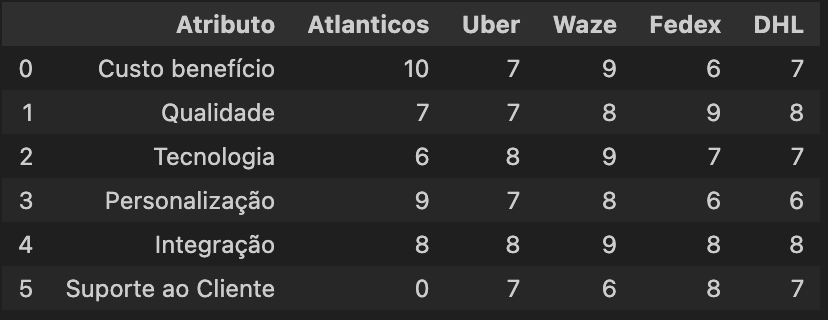
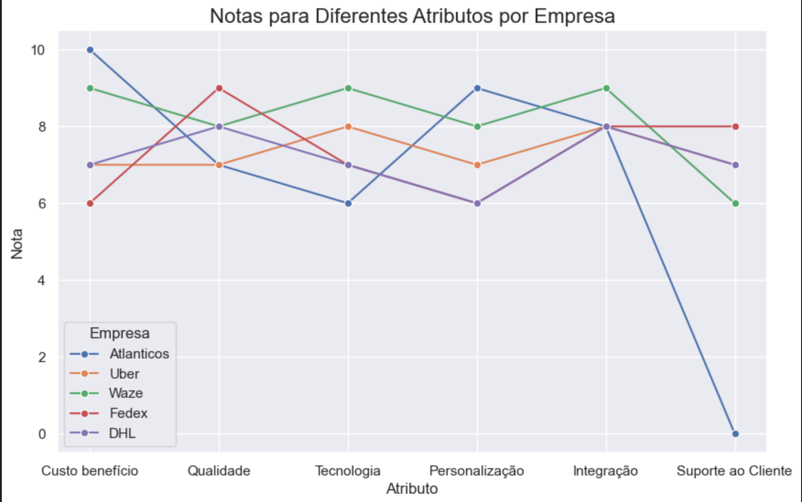
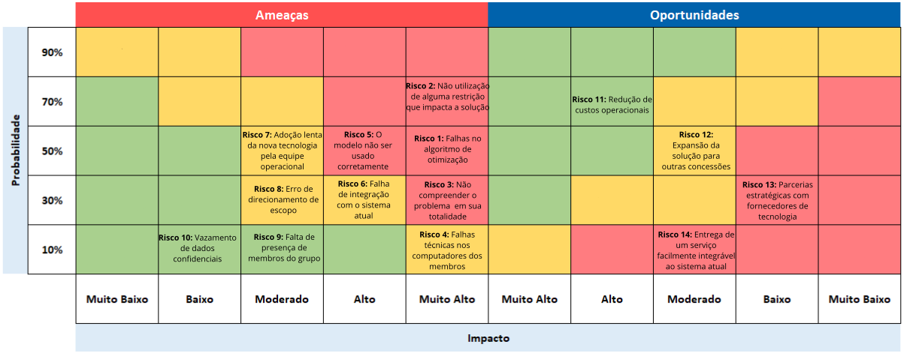

# Entendimento do Negócio

## Matriz Oceano Azul

O framework "Oceano Azul" foi desenvolvido por W. Chan Kim e pela Renée Mauborgne em 2005 com a missão de oferecer uma abordagem estratégica inovadora às empresas, incentivando a exploração de novos mercados(oceano azul), onde a competição é quase inexistente, as regras ainda não foram definidas, e existe uma rica possibilidade de crescimento e lucro, ao invés de batalhar em mercados saturados, os "oceanos vermelhos", onde as regras são amplamente conhecidas e existe muita competição.

Nessa estratégia são usadas quatro ações: Reduzir, Eliminar, Aumentar e Criar. Essas ações visam diferenciar as empresas e produtos, permitindo que se destaquem em ambientes de mercado não convencionais e inexplorados.

### Reduzir
Essa ação tem o objetivo de minimizar os elementos que a indústria geralmente sobrecarrega, permitindo que as empresas reduzam despesas e otimizem recursos, eliminando ou reduzindo elementos do produto, ou serviço que não agregam valor significativo ao cliente.

### Eliminar
O objetivo é erradicar os elementos que a indústria sempre considerou como padrão, removendo características ou serviços dispensáveis que não são essenciais para os clientes. Isso possibilita às empresas oferecerem propostas mais enxutas e diferenciadas, muitas vezes a um custo mais acessível.

### Aumentar 
O propósito é elevar acima do padrão da indústria certos elementos do produto ou serviço para superar as expectativas tradicionais. Desta forma, as empresas podem se destacar da concorrência e criar um valor percebido mais elevado para os consumidores.

### Criar 
O foco está em introduzir novos elementos que a indústria ainda não oferece. Com isso, as empresas podem preencher lacunas no mercado e satisfazer necessidades não atendidas dos consumidores, apresentando soluções inovadoras e conquistando uma base de clientes fiéis.

### Incorporando no projeto 
Para realizar a avaliação de valor foi pesquisado empresas que tivessem soluções semelhantes criadas. 

Entre elas temos:

- **Uber** : O Uber é uma empresa líder no setor de transporte, que utiliza algoritmo de otimização para calcular as rotas mais eficientes e rápidas para os motoristas, levando em consideração uma variedade de variáveis, como tráfego, distância e tempo estimado de chegada, permitindo que os motoristas maximizem sua eficiência e ganhos, enquanto garantem que os passageiros cheguem ao seu destino de forma rápida e conveniente.

- **Waze**: O Waze é uma plataforma de navegação líder com suatecnologia avançada de algoritmo de otimização utiliza dados em tempo real de milhões de usuários para calcular as melhores rotas, garantindo que os motoristas cheguem ao seu destino de forma rápida e segura.

- **Fedex**: A FedEx é uma empresa líder no setor de logística e entrega, reconhecida por sua abordagem inovadora para ajudar empresas e indivíduos a enviar e receber pacotes de forma rápida e eficiente. Com sua ampla gama de serviços e soluções avançadas, a FedEx capacita as empresas a otimizar suas operações de envio e recebimento de mercadorias. Ela oferece uma solução abrangente de logística e entrega, focada na automação e otimização de processos para garantir que os pacotes sejam entregues no prazo e com precisão. Empresas de diversos setores, como Coca-Cola, Unilever e American Express, reconhecem o valor da FedEx como uma solução confiável e eficiente de logística e entrega.

- **DHL**: Fundada em 1969 na Alemanha, a DHL se expandiu para se tornar uma das principais empresas globais de logística. Especializada em soluções avançadas de cadeia de suprimentos e logística, a DHL oferece ferramentas e tecnologias de ponta para ajudar as empresas a otimizar suas operações e melhorar a eficiência na gestão da cadeia de suprimentos. Com uma rede global abrangente e parcerias estratégicas com empresas líderes em diversos setores, como Pepsi, Walmart e outras, a DHL é reconhecida por sua confiabilidade, velocidade e precisão na entrega.

Com base nas empresas mencionadas, foi elaborada uma tabela atribuindo valores para cada atributo em relação a cada empresa. Esses valores refletem o desempenho de cada empresa em cada atributo específico. Em seguida, foi criado um gráfico para proporcionar uma visualização mais clara das diferenças entre os concorrentes em relação a esses atributos ou características.

Figura 1 - Tabela de Notas

Fonte: Material produzido pelos autores (2024)

Figura 2 - Matriz de Valor

Fonte: Material produzido pelos autores (2024)

### Atributos 

**1 - Custo Benefício**: O equilíbrio entre o custo e o benefício é essencial. Os clientes valorizam produtos ou serviços que oferecem um excelente desempenho ou funcionalidade em relação ao preço pago. Esse atributo leva em consideração a relação entre o valor entregue pela solução e o custo para adquiri-la.

**2 - Qualidade**: O atributo qualidade refere-se à capacidade de proporcionar uma experiência excepcional aos clientes, superando suas expectativas em termos de serviço, produto ou atendimento. Isso implica não apenas em resolver eficazmente os problemas dos clientes, mas também em fazê-lo de maneira ágil, cortês e personalizada. Quando os clientes recebem um serviço ou produto de alta qualidade que atende ou excede suas expectativas, eles não apenas ficam satisfeitos, mas também têm maior probabilidade de se tornarem defensores da marca, recomendando-a a outras pessoas.

**3 - Tecnologia**: O atributo tecnologia diz respeito à capacidade da empresa em utilizar recursos tecnológicos avançados para melhorar suas operações e oferecer soluções inovadoras aos clientes. Isso envolve a adoção de sistemas e ferramentas modernas, como automação de processos, análise de dados avançada e inteligência artificial, para proporcionar uma experiência de alta qualidade e eficiência. Em suma, a tecnologia é essencial para impulsionar o crescimento e a competitividade da empresa no mercado atual.

**4 - Personalização**: A capacidade de personalização permite que a empresa atenda às demandas individuais dos clientes, adaptando seus produtos ou serviços de acordo com suas preferências e comportamentos específicos. Isso resulta em uma experiência única para cada cliente. Essa característica avalia a flexibilidade da empresa em permitir que os clientes personalizem o produto ou serviço de acordo com seus critérios individuais, sem comprometer a qualidade ou a experiência do usuário.

**5 - Integração**: Este atributo diz respeito à habilidade do software de se conectar de maneira eficiente com outros sistemas e aplicativos, facilitando a troca de informações e a colaboração entre diferentes partes do ambiente de tecnologia da informação.

**6 - Suporte ao Cliente**: Um suporte ao cliente eficaz é essencial para resolver problemas, esclarecer dúvidas e assegurar uma experiência positiva para os clientes. Este fator avalia a disponibilidade e a eficiência com que a empresa aborda as questões e preocupações dos clientes, garantindo que suas necessidades sejam atendidas prontamente e de forma satisfatória.

**7 - Sustentabilidade**: Este atributo avalia o compromisso da solução com práticas ambientalmente sustentáveis e responsabilidade social. A sustentabilidade envolve o uso eficiente de recursos, a preferência por materiais recicláveis e tecnologias que minimizam as emissões de poluentes. Além disso, contempla o impacto positivo no bem-estar das comunidades locais. Este aspecto fortalece a imagem corporativa e aumenta a fidelização de clientes através de práticas que respeitam o meio ambiente e contribuem socialmente.

**8 - Escalabilidade**: A escalabilidade refere-se à capacidade da solução de expandir e adaptar-se com eficiência. Essencial para empresas em crescimento ou com variações de demanda, permite aumentar a base de usuários ou serviços oferecidos com custos adicionais mínimos. Uma solução escalável sustenta o aumento do volume de operações sem a necessidade de alterações significativas na infraestrutura, assegurando o desempenho a longo prazo.

### Modelo das 4 ações

**Reduzir**: A decisão de reduzir o atributo de Integração reflete a necessidade de simplificar a implementação em face das restrições de tempo e recursos. Reduzir a complexidade das integrações não essenciais permite concentrar esforços nas funcionalidades críticas da aplicação, o que facilita o desenvolvimento e a manutenção, minimizando os riscos de atrasos e falhas técnicas. Essa abordagem visa otimizar a entrega do projeto, garantindo que os recursos sejam alocados de maneira mais eficiente.

**Aumentar**: Para ampliar o valor percebido pelos usuários finais, será aumentado o atributo de Custo-Benefício através da escolha estratégica de tecnologias e métodos que proporcionem um alto retorno sobre o investimento. Ademais, o aprimoramento da Personalização será uma prioridade, desenvolvendo a aplicação de forma que ela possa ser facilmente ajustada para atender às demandas específicas dos clientes, garantindo que as funcionalidades entregues maximizem a satisfação do usuário. Isso inclui a adaptação da interface e das funcionalidades ao perfil e às necessidades de cada cliente, proporcionando uma experiência única e altamente relevante.

**Criar**: Com o intuito de inovar no mercado, será criado o atributo de Tecnologia, incorporando algoritmos avançados para otimizar a designação de tarefas e alocar recursos de maneira mais eficiente. A criação desses algoritmos permitirá a análise e o processamento de dados em tempo real, o que não só melhora a eficiência operacional como também eleva a qualidade do serviço prestado. Além disso, a adição de Sustentabilidade como um novo atributo destaca o compromisso da solução com práticas ambientalmente responsáveis, diferenciando-a no mercado ao atender a crescente demanda por soluções ecológicas.

**Eliminar**: A decisão de eliminar o recurso de Suporte ao Cliente do projeto foi tomada devido ao prazo apertado de apenas 10 semanas para o desenvolvimento. A equipe concluiu que não seria possível fornecer um suporte ao cliente eficiente e abrangente dentro deste período limitado. Embora o suporte ao cliente seja fundamental, as restrições de tempo nos obrigaram a priorizar outras áreas do projeto, como o desenvolvimento e a qualidade do produto, para garantir que a entrega seja realizada no prazo e que o produto atenda às expectativas dos usuários durante o uso.

## Análise Financeira

&emsp;&emsp;A análise financeira de um projeto é uma avaliação detalhada dos aspectos monetários relacionados a ele. Envolve a análise dos investimentos necessários, dos custos esperados e das receitas projetadas ao longo de um determinado período, geralmente um ano. Esta análise é crucial para entender a viabilidade financeira do projeto e tomar decisões informadas sobre sua implementação.

&emsp;&emsp;O primeiro passo na análise financeira é determinar o montante de investimento necessário para iniciar e manter o projeto. Isso inclui custos como aquisição de equipamentos, contratação de pessoal, despesas operacionais, entre outros. Conhecer esses valores é fundamental para planejar adequadamente o financiamento do projeto.

&emsp;&emsp;Em seguida, é importante projetar os custos operacionais esperados ao longo do período em análise. Isso inclui despesas recorrentes como salários, aluguel, matéria-prima, marketing, entre outros. A compreensão desses custos permite estimar o ponto de equilíbrio do projeto e determinar se ele será capaz de gerar lucro.

&emsp;&emsp;Além dos custos, a análise financeira também examina as projeções de receitas relacionadas ao projeto. Isso envolve estimar as vendas esperadas, considerando fatores como demanda de mercado, preços de venda, sazonalidade, entre outros. A receita projetada é essencial para calcular o potencial de retorno sobre o investimento e avaliar a lucratividade do projeto.

&emsp;&emsp;Em resumo, a análise financeira do projeto fornece uma visão abrangente dos aspectos monetários envolvidos, desde os investimentos iniciais até as receitas esperadas. Sua importância reside em fornecer informações críticas para a tomada de decisão, ajudando os parceiros a avaliar o risco e a rentabilidade do projeto antes de sua implementação.

1. Projeções de Custo

    &emsp;&emsp;As projeções de custo são estimativas ou previsões dos gastos que uma empresa ou projeto pode incorrer ao longo de um período específico. Essas projeções abrangem diversas áreas, como custos operacionais, de produção, de pessoal, de marketing e administrativos. Baseadas em análises detalhadas das despesas passadas e considerações sobre mudanças futuras no ambiente econômico e de mercado, essas projeções são fundamentais para o planejamento financeiro, a definição de metas realistas e a tomada de decisões estratégicas.

    &emsp;&emsp;Para as projeções de custo, vamos considerar que a hora de trabalho de cada desenvolvedor do grupo é de R$ 80 e que cada membro se dedicará 5 horas por dia, 5 dias por semana. Sabendo que o grupo é composto por 7 membros, o cálculo do custo de oportunidade do grupo é: $$\text{Custo} = \text{Horas} \times \text{Preço por hora} \times \text{Dias de Trabalho (Semana)} \times \text{Número de Semanas} \times \text{Número de Desenvolvedores}$$

    &emsp;&emsp;E aplicando essa equação dentro do nosso projeto fica: $$\text{Custo} = 5 \times 80 \times 5 \times 10 \times 7 = R\$140.000$$

2. Projeções de Receita

    &emsp;&emsp;As projeções de receita são estimativas das entradas de dinheiro que uma empresa ou projeto pode receber ao longo de um período específico. Com base no histórico de vendas, nas tendências de mercado e nas estratégias de marketing, essas projeções oferecem uma visão clara do potencial de receita e auxiliam na elaboração de orçamentos e na definição de metas de vendas. Essa análise é essencial para o planejamento financeiro e o desenvolvimento de estratégias de crescimento.

    &emsp;&emsp;Dado que o projeto visa principalmente a redução de custos, o maior benefício proporcionado pelo projeto seria a diminuição das despesas, resultante de rotas mais eficientes. Isso implicaria na redução do número de leituristas necessários, em comparação com o quadro atual. Considerando o gasto médio mensal de R$ 6000 por leiturista e uma força de trabalho de 500 leituristas (média calculada a partir dos números fornecidos na conversa e do total exposto no Tapi), o custo mensal apenas com salários seria de R$ 3.000.000. Portanto, o ganho final seria: $$\text{Economia} = 10\% \times 3.000.000 = 300.000$$

3. Analise de Custo Estimada para o Primeiro Ano

    &emsp;&emsp;A análise de custos para o primeiro ano é uma estimativa que projeta as despesas previstas para um novo projeto, produto ou empreendimento ao longo de seu primeiro ano de operação. Nela, consideram-se custos como salários, aluguel, materiais, marketing, e também despesas únicas relacionadas ao lançamento. Essa avaliação é fundamental para o planejamento financeiro, fornecendo uma compreensão clara dos recursos necessári\\os para iniciar e sustentar o projeto nos estágios iniciais. Além disso, ela ajuda a identificar potenciais gargalos ou desafios financeiros, permitindo ajustes antecipados para garantir um início bem-sucedido.

    - **Custo de implementação**:R$140.000 
    - **Econimia Anual**: 300.000 x 12 meses = R$3.600.00
    - **Lucro líquido Estimado**: 3.600.00 - 140.000 = R$3.460.00

    A otimização das rotas de leitura de hidrômetros pode trazer retornos financeiros substanciais para a Aegea Saneamento, com uma estimativa de economia anual que supera os custos iniciais do projeto. Ao investir em eficiência operacional, a empresa não só reduz os custos relacionados ao pessoal, mas também melhora a qualidade do serviço e a satisfação do cliente.

4. Otimazação da Cobrança

    &emsp;&emsp;A otimização da cobrança envolve o aprimoramento de estratégias e processos para maximizar a eficiência na recuperação de valores devidos. No escopo do projeto, busca-se encontrar melhores rotas para os leituristas e melhorar o cash flow da Aegea Saneamento.

    &emsp;&emsp;Durante o kick-off, os colaboradores da Aegea Saneamento compartilharam uma preocupação relevante: o prazo de pagamento dos clientes, que varia entre $D+10$ para dias úteis e $D+13$ para sextas-feiras, representa um desafio significativo para a empresa. Esse curto período para cobrança, especialmente nas áreas atendidas pela Águas do Rio, coloca uma pressão adicional sobre o cash flow da Aegea. Com apenas 22 dias disponíveis para realizar todas as cobranças, qualquer atraso na cobrança pode resultar em um descompasso entre as entradas de receita e os custos operacionais, o que pode afetar negativamente a saúde financeira da empresa.

    &emsp;&emsp;Para enfrentar essa questão, a proposta de desenvolver um algoritmo de otimização do caminho mínimo se mostra essencial. A ideia é criar uma rota mais eficiente para os leituristas, permitindo que eles otimizem o tempo de coleta de dados e maximizem sua eficácia na cobrança. Dessa forma, é possível não só reduzir o tempo necessário para cobrar todas as áreas da Águas do Rio, mas também criar uma margem de segurança para alinhar as receitas com os custos de maneira mais consistente ao longo do mês. Essa abordagem não apenas contribui para melhorar o cash flow da Aegea, mas também fortalece sua posição financeira e sua capacidade de planejamento a longo prazo.

## Canvas Proposta de Valor

&emsp;&emsp;Segundo o The Business Model Analyst, o Canvas é "uma ferramenta de negócios projetada para garantir que o produto ou serviço de uma empresa esteja alinhado com os valores e necessidades dos clientes". Foi criado por Alexander Osterwalder, Yves Pigneur, and Alan Smith em 2013. O desenvolvimento do canvas para o projeto é de suma importância, ele ajudar a entender as necessidades dos clientes e assim desenvolver um produto que é realmente útil para o cliente salvando tempo e dinheiro no processo de produção.

&emsp;&emsp;Abaixo segue a imagem que contém o Canvas Proposta de Valor desenvolvido pelo grupo. Em seguida uma descrição mais detalhada de cada tópica presente no template.

Imagem 1 - Template Canvas Proposta de Valor

Fonte: Autoria Própria

**Perfil do Cliente**  
Tarefas:  
- Roteirização dos caminhos que serão utilizados pelos leituristas de forma intuitiva  

Dores:  
- Rotas pouco otimizadas: O cliente enfrenta dificuldades devido à falta de otimização das rotas de leitura, o que resulta em desperdício de tempo e recursos.
- Incerteza da obtenção do volume consumido: Existe uma preocupação com a precisão na obtenção do volume consumido, o que pode levar a discrepâncias nos registros de consumo.

Ganhos:  
- Aumento do faturamento: Otimizando as rotas de leitura, há a expectativa de um aumento no faturamento da empresa, decorrente de uma leitura mais precisa e completa dos hidrômetros.  
- Diminuição da quantidade de rotas: Com a implementação de rotas mais eficientes, espera-se uma redução na quantidade de rotas necessárias para cobrir uma determinada área, o que resultará em economia de recursos.
- Aumento da adimplência: Uma leitura mais precisa dos hidrômetros pode contribuir para o aumento da adimplência dos clientes, pois reduz a probabilidade de erros nos registros de consumo, garantindo faturas mais precisas e justas.  

**Mapa de valor**   
Analgésicos: 
- Redução de custos operacionais: Além da garantia na leitura dos hidrômetros, destacar a redução de custos associados a erros de medição e correções posteriores.
- Melhoria na Experiência do Cliente: Apontar como uma leitura mais precisa dos hidrômetros pode levar a faturas mais precisas e, consequentemente, a uma melhor experiência para o cliente final.
- Aumento da Confiança: Enfatizar como a garantia de leitura precisa dos hidrômetros contribui para a confiança do cliente na empresa de serviços públicos, fortalecendo assim o relacionamento com o cliente.  

Criadores de ganho:  
- Otimização de Recursos: Destacar como a simplificação na construção das rotas permite a alocação mais eficiente de recursos, como tempo e mão de obra, resultando em economia e aumento da produtividade.
- Flexibilidade na Adaptação: Enfatizar a capacidade de adaptação do sistema às mudanças nas condições de rota ou na demanda de leitura, garantindo que as operações permaneçam eficientes mesmo diante de variações.
- Aumento da Competitividade: Mostrar como a capacidade de construir rotas de forma mais rápida e eficaz pode dar à empresa uma vantagem competitiva no mercado, permitindo que ela se destaque pela qualidade e eficiência do serviço oferecido.  

Produtos e serviços:  
- Implementação de um algoritmo de otimização de rotas personalizado, permitindo uma distribuição mais eficiente das tarefas do leiturista e garantindo maior cobertura de leitura em menos tempo.

&emsp;&emsp;Resumindo, durante a conversa com o parceiro e ao longo do desenvolvimento do canvas, foi possível identificar a principal dor enfrentada por eles: as rotas pouco otimizadas utilizadas pelos leituristas. Compreendendo plenamente o problema, a equipe conseguiu estruturar uma solução que atenderá efetivamente às necessidades da Aegea. Em outras palavras, foi o Canvas Proposta de Valor que auxiliou no entendimento do problema e no desenvolvimento de uma solução de qualidade.

## Matriz de Riscos

&emsp;&emsp;Segundo a FIA Business School, risco é toda fonte de incerteza presente em todas as etapas de determinada atividade. Estes são fatores externos e internos que podem coibir ou alavancar o desenvolvimento de um processo esperado. Pensando nestes, foi desenvolvida uma Matriz de Riscos, um _framework_ frequentemente utilizado na área de _business_ que tem como principal objetivo elencar e compreender todas as problemáticas e oportunidades que existem ao redor de um projeto ou negócio.  

&emsp;&emsp;Vale ressaltar que, além de um guia para os possíveis problemas e possibilidades que podem surgir, é empírica a criação de sugestões de ação para cadauma das possibilidades elencadas, tornando a matriz em algo que transcende uma ferramenta de visualização, mas também um guia para a ação proativa, fomentando uma cultura de vigilância e adaptabilidade.

&emsp;&emsp; Abaixo, segue a representação visualizada:

Imagem 2 - Template Matriz de Risco

Fonte: Autoria Própria

&emsp;&emsp;A seguir, pode-se visualizar cada um dos riscos e oportunidades, seguidos de seus respectivos planos de ação:

### Riscos:

  
<b>Quadro 1 </b>- Ameaças 

| Ameaça             | Descrição                                                                                         | Plano de Ação                                                                                              |
|--------------------|---------------------------------------------------------------------------------------------------|-----------------------------------------------------------------------------------------------------------|
| **Risco 01**       | Falhas no algoritmo de otimização                                                                | Realizar testes efetivos para evitar quaisquer divergências.                                        |
| **Risco 02**       | Não utilização de alguma restrição que impacta a solução                                                  | Aplicar uma revisão conceitual completa, além de verificar com os parceiros de projeto.                                       |
| **Risco 03**       | Não compreender o problema  em sua totalidade                                          | Comunicação efetiva e constante com a empresa parceira, para verificar a adequação ao problema.                            |
| **Risco 04**       | Falhas técnicas nos computadores dos membros                                                                 | Implementar uma estratégia de backup dos dados e planos alternativos de hardware.                              |
| **Risco 05**       | O modelo não ser usado corretamente                                                              | Disponibilizar instruções detalhadas e treinamento para os usuários finais.                                |
| **Risco 06**       | Falha de integração com o sistema atual                                                             | Desenvolver uma saída em comum e que possa ser utilizada pelo sistema atual                           |
| **Risco 07**       | Adoção lenta da nova tecnologia pela equipe operacional                                              | Disponibilizar instruções detalhadas e treinamento para os usuários finais.                                   |
| **Risco 08**       | : Erro de direcionamento de escopo                                                     | Realziar um contato constante com a empresa parceira, a fim de reavaliar a consistência do escopo                         |
| **Risco 09**       | Falta de presença de membros do grupo                                                            | Definir um cronograma claro e comunicar ausências com antecedência.                                        |
| **Risco 10**       | Vazamento de dados confidenciais                                                           | Preparar os repositórios públicos sem quaisquer informação que não possa estar disponível externamente.                                         |

  
Fonte: Elaborada pelos Autores

### Oportunidades

  
<b>Quadro 1 </b>- Ameaças 

| Ameaça             | Descrição                                                                                         | Plano de Ação                                                                                              |
|--------------------|---------------------------------------------------------------------------------------------------|-----------------------------------------------------------------------------------------------------------|
| **Risco 11**       | Redução de custos operacionais                                                     | Implementar um algoritmo capaz de diminuir os custos operacionais e demonstrar como estes podem ser aplicados a partir de cálculos matemáticos.                          |
| **Risco 12**       | Expansão da solução para outras concessões                                                     | Desenvolver o algoritmo de forma a ser utilizado em várias instâncis com ppoucas mudanças.                                     |
| **Risco 13**       | Parcerias estratégicas com fornecedores de tecnologia                                     | Demonstrar e apresentar a solução para outras empresas interessadas em modelos semelhantes.                                  |
| **Risco 14**       | Entrega de um serviço facilmente integrável ao sistema atual                                     | Criar documentação detalhada e com similaridades ao modelo atual de representação das rotas.                                |

  
Fonte: Elaborada pelos Autores

Fontes: 

[[1] The Business Model Canvas. (acessado em 22/04/24)](https://businessmodelanalyst.com/value-proposition-canvas/#What_are_the_advantages_of_using_the_Value_Proposition_Canvas)

[[2] FIA School of Business. (acessado em 23/04/24)]( (https://fia.com.br/blog/risco-de-negocio/) )

[[3] UBER. Quem somos. (acessado em 19/04/24)]( (https://www.uber.com/br/pt-br/about/) )

[[4] WAZE. Servidor de rotas. (acessado em 19/04/24)]( (https://www.waze.com//wiki/Brazil/Servidor_de_Rotas#:~:text=O%20algoritmo%20do%20Waze%20utiliza,30%20minutos%20da%20posição%20inicial) )

[[5] FEDEX.Desvendando a FedEx Logística: Entendendo os Segredos de Uma Potência Global em Entregas. (acessado em 19/04/24)]( (https://logisticatotal.com.br/fedex-logistica/) )

[[6] DHL.GREENPLAN – ESPECIALISTAS EM LOGÍSTICA LANÇAM ALGORITMO PODEROSO PARA OTIMIZAÇÃO DE ROTAS INDIVIDUAIS. (acessado em 19/04/24)]( (https://www.dhl.com/pt-pt/home/imprensa/imprensa-arquivo/2020/greenplan-especialistas-em-logistica-lancam-algoritmo-poderoso-para-otimizacao-de-rotas-individuais.html) )

