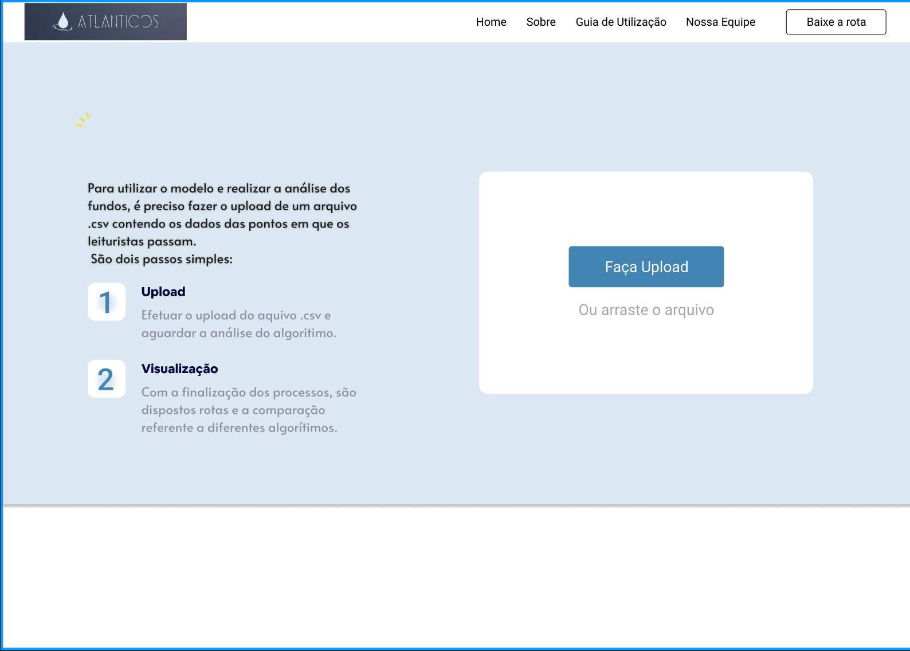
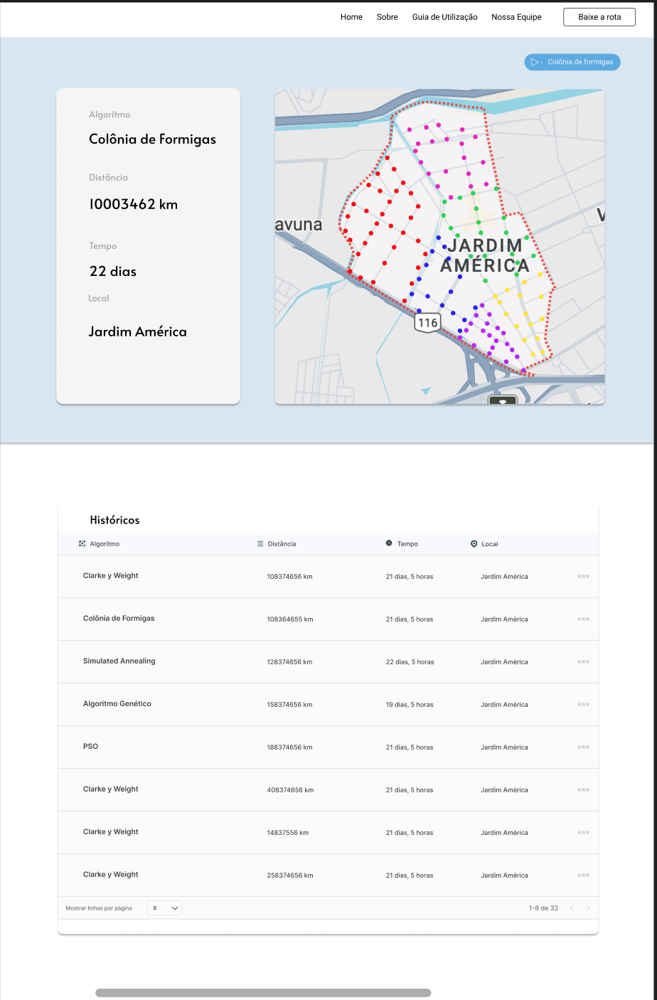
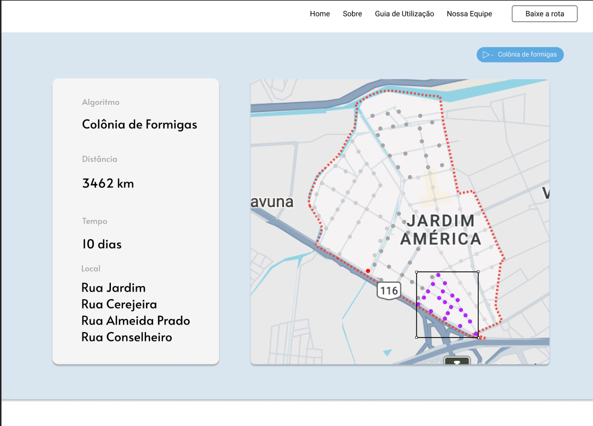
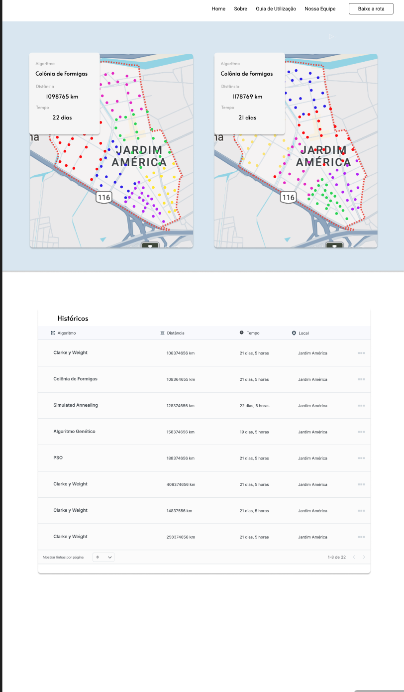

Este arquivo serve para comentar os avanços referentes ao front end, como é fizemos a prototipagem pelo figma, as atualizações serão feitas por aqui.

# Frontend

## Wireframes

&emsp;&emsp;Um wireframe é uma representação visual simplificada de uma interface de usuário, essencial no design de sistemas digitais como websites, aplicativos móveis ou softwares. Ele atua como uma ferramenta fundamental no processo de design, organizando os elementos cruciais de uma interface de maneira esquemática, utilizando linhas, formas geométricas e ícones para delinear a disposição de componentes como botões, campos de texto, imagens e áreas de conteúdo.

&emsp;&emsp;Os wireframes servem como esboços preliminares que facilitam a visualização da arquitetura da interface e ajudam a compreender a hierarquia de informações e a interação entre os elementos. Ao desenvolver um wireframe, o foco é colocado na estrutura e usabilidade, permitindo refinamentos na experiência do usuário antes de avançar para aspectos visuais mais detalhados. Esta abordagem economiza tempo e esforço, pois modificações significativas na estrutura são mais facilmente implementadas nas fases iniciais do projeto, após a revisão e aprovação pelo cliente.

&emsp;&emsp;No contexto do projeto Atlânticos da Aegea Saneamento, os wireframes são utilizados para esquematizar a interface do sistema de otimização de rotas para leitura de hidrômetros. O sistema foi desenhado para incluir telas principais que abordam aspectos cruciais das necessidades operacionais e estratégicas da empresa. Especificamente, o sistema conta com uma interface principal que permite a importação de dados dos hidrômetros, visualização e otimização das rotas, além de um painel de monitoramento e relatórios de desempenho. A decisão de usar a plataforma de desenvolvimento escolhida, que oferece robustez e flexibilidade, permite a integração eficiente de funcionalidades IoT necessárias para a coleta e análise de dados operacionais, refletindo um exemplo prático da aplicação de wireframes no desenvolvimento do projeto Atlânticos.

## Mockup 
### Upload 

Essa seria a tela inicial, onde o usuário faria oupload do arquivo csv dos pontos referente a rota em nossa aplicação.

Figura 1 - Tela upload csv

Fonte: Material produzido pelos autores (2024)

Ao fazer upload, o usuário cai na tela geral onde um algoritmo é rodado, e é mostrado as informações sobre distância, tempo e local, além dos cluster 

Figura 2 - Tela mapa 

Fonte: Material produzido pelos autores (2024)

Nessa tela também é possível ver o histórico de algoritmos que foram rodados, com suas informações mais relevantes e tamném é possível rodar outros algorítmos. 

Os clusters são interativos, quando o mouse passa por cima de cada no mapa, aparece eles em highlight e ao clicar neles, as informações do lado mudam, referentes aquela região

Figura  3 - Tela cluster 

Fonte: Material produzido pelos autores (2024)

Além disso na parte de históricosm é possível abrir de nova as rotas rodadas por algoritmos anteriores, e comparar com mapas já abertos com suas referentes informações. 

Figura  3 - Tela comparação 

Fonte: Material produzido pelos autores (2024)

Link figma : https://www.figma.com/file/BayaP9bQcRfxlw2vqOicjw/Wireframes?type=design&node-id=0-1&mode=design&t=xcSKahIksb2Yud7P-0