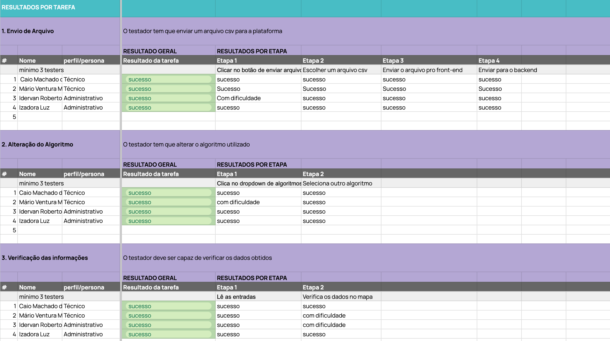

# Teste de usabilidade

&emsp;&emsp; O teste de usabilidade pode ser considerado como uma metodologia de pesquisa que analisa e ajuda a compreender o comportamento do usuário final quando este interage com uma interface. Nesse viés, tal método permite encontrar problemas e oportunidades para o sistema testado e, além disso, permite conhecer com mais afinidade o usuário final.

&emsp;&emsp;Nesse sentido, o teste de usabilidade implementado neste projeto foi um teste , no qual os testadores são acompanhados por instrutores, com a utilização de tarefas de teste, as quais representam os objetivos do teste, e com dois tipos de usuários, baseado em nossas personas: analista de TI,com o intuito de analisar com mais tecnicidade a aplicação, e planejadora na Aegea Saneamentos, com o
intuito de analisar a funcionalidade e a usabilidade da aplicação

&emsp;&emsp;Dessa forma, os objetivos do teste (os pontos que precisam ser testados) foram contemplados por meio de tarefas de teste. Posto isso, 3 tarefas foram desenvolvidas, abordando as principais funcionalidades presentes na aplicação durante a realização dos testes e as principais demandas do cliente. 

&emsp;&emsp;Os resultados estão expostas natabela a seguir: 

Imagem 1 - Testes de usabilidade

Fonte: Autoria Própria

## Resultados 

&emsp;&emsp; As tarefas foram proclamadas durante o teste em forma de perguntas, como: “Como você faria para enviar os dados sobre as rotas para a plataforma?” e, então, o processo de pensamento e o comportamento do usuário era analisado, de modo a encontrar possíveis insights para o sistema como um todo. Aplicamos em 4 testadores e os resultadosdas tarefas foram: 

- **Tarefa 1: Envio de Arquivo** : 100% dos participantes conseguiram enviar o arquivo csv para a plataforma, porém dentre eles, 1 teve dificuldade em realizar a a etapa de "clicar no botão de enviar arquivo", porém entendemos que isso ocorreu devido a idade e falta de conhecimento do testador por se tratar de uma pessoa de mais idade e não é muito familiarizado com essas ferramentas e não é uma situação recorrente. 

- **Tarefa 2: Alteração do Algoritmo** : 100% dos participantes conseguiram alterar o algoritmo, porém durante a primeira etapa, um usuário não entendeu que o algoritmo não estava pré-definido devido a um erro de feedback que a plataforma projetou escrito "carregando" nas informações e ficou aguardando as informações aparecerem. 

- **Tarefa 3: Verificação das informações** :100% dos participantes conseguiram verificar os dados obtidos nos resultados gerais. Durante a etapa 1  não foi percebida nem informada pelos testadores nenhuma dificuldade na realização desta tarefa, porém na etapa 2, 2 usuários tiveram dificuldade em interpretar as informações e dados do mapa, como cores e temas, onde a rota começava e terminava e a situação de manuseio do mapa, como a aproximação e outras funcionalidades. Isso ocorreu devido a falta de legendas projetadas no mapa

## Conclusões e melhorias

De modo geral os testes foram um sucesso, com resultados positivos, ficando claro que a plataforma esta intuitiva de certa forma, conseguindo colaborar para os nossos principais usuários, realizando a sua principal função que seria a otimização de rotas. 
Apesar dos resultados positivos, o grupo chegou a conclusão que os principais pontos de melhorias seriam pequenas mudanças e que vamos adicionar a plataforma como: Adicionar uma contextualização com um pop-up de que é necessário escolher um algoritmo, além de adicionar uma legenda no mapa plotado, e  para pontos de início e final de rotas para seu melhor entendimento e um pop-up que indica os próximos passos do usuário após a esolha do mapa, assim melhorando a sua usabilidade, e melhor processamento de informações dos usuários.

Link para o a tabela: https://docs.google.com/spreadsheets/d/1hKvFOh_3EW3n6FdolOuwCqhOXzkWDkSSkx4fbqKVJiU/edit#gid=700059903

